# Back-end

En este README voy a incluir las instrucciones de instalacion y configuracion que llegue a utilizar.

## Creación del proyecto: Guía para la creación de este repositorio

Crear un directorio para contener el proyecto llamado `node-rest`.

Inicializar el repositorio de Git:

```sh
git init
```

Crear un archivo `/.gitignore` y colocar lo siguiente:

```
# Ignorear dependencias de Node.js
/node_modules
```

Crear un archivo `/Dockerfile` y colocar lo siguiente:

```
# Utilizar imagen base de Node.js
FROM node:lts-slim

# Crear y cambiar el directorio actual a /app
WORKDIR /app/

# Copiar el contenido del proyecto actual a /app
COPY . /app/

# Exponer puerto 80
EXPOSE 80
```

Crear un archivo `/.dockerignore` y colocar lo siguiente:

```
# Excluir directorio de dependencias de Node.js
node_modules
```

Crear un archivo `/docker-compose.yml` y colocar lo siguiente:

```yml
version: '3'
services:
    web-service:
        build: .
        volumes:
            - .:/app
            - /app/node_modules
        ports:
            - 3100:80
```

Abrir una terminal y ejecutar lo siguiente:

```sh
docker-compose up -d
```

Una vez que estén iniciados los servicios, ejecutar lo siguiente:

```sh
docker exec -it node-rest-web-service-1 sh
```

> **NOTA**  
> El nombre del contenedor (`node-rest-master`) puede cambiar dependiendo
> del nombre que se le haya asignado al directorio del proyecto.

Una vez accediendo a la terminal ejecutar lo siguiente, que creará el archivo
package.json del proyecto:

```sh
npm init
```

Una vez creado el `/package.json` en el directorio del proyecto, proceder con la
instalación de los siguientes módulos:

```sh
npm install express body-parser mysql2 knex
```

```sh
npm install -D nodemon 
```

Una vez instalados los paquetes, deberán aparecer el archivo
`/package-lock.json` y el directorio `/node_modules` en el proyecto.

Modificar el archivo `/package.json` para incluir las siguiente instrucciones en
scripts:

```json
"scripts": {
    "start": "node ./src/app.js",
    "debug": "nodemon ./src/app.js -L"
}
```

Crear un archivo `/src/app.js` y colocar lo siguiente:

```js
const express = require('express');
const app = express();
const port = 80;

app.get('/', function (req, res) {
    res.statusCode = 200;
    res.setHeader('Content-Type', 'text/plain');
    res.send('Hola Mundo');
});

app.listen(puerto, function() {
    console.log("Servidor en espera http://localhost");
});
```

Modificar el archivo `Dockerfile` para que quede de la siguiente manera:

```
# Utilizar imagen base de Node.js
FROM node:lts-slim

# Crear y cambiar el directorio actual a /app
WORKDIR /app/

# Copiar archivo de dependencias.
COPY ./package*.json /app/

# Copiar el contenido del proyecto actual a /app
COPY . /app/

# Exponer puerto 80
EXPOSE 80

# Iniciar aplicación
CMD ["npm", "start"]
```

Modificar el archivo `docker-compose.yml` para que quede de la siguiente manera:

```yml
version: '3'
services:
    web-service:
        build: .
        volumes:
            - .:/app
            - /app/node_modules
        ports:
            - 3100:80
        command: ["npm", "run", "debug"]
```

### Base de Datos

Con cada cambio que haga en la base de datos que es el archivo que se ubica en la carpeta *scripts* con el archivo de **database.sql** tengo que ejecutar los siguientes comandos en la terminal:

Para bajarlo
```
docker-compose down -v   
```
Para subirlo
```
docker-compose up --build -d     
```
Estos fueron los cambios que hice en la base de datos.
Agregue una nueva tabla llamada **Guardar** y en ella puse los campos:

- Id_usuario
- nombre
- correo
- contraseña
  
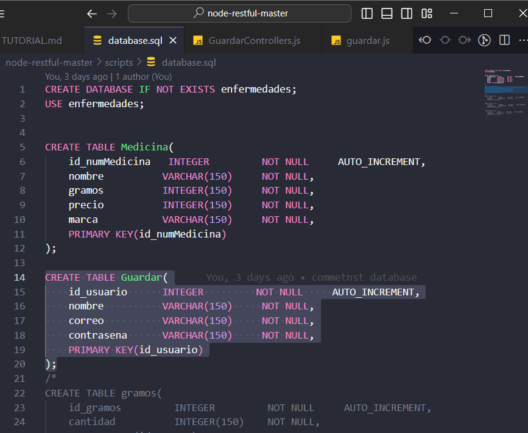

Despues de hacer estos cambios ejecuté los comandos que anteriormente dije y seguí con los demas archivos.

### Models

Creé un archivo .js en la carpeta models con el nombre de **guardar.js** en donde puse lo siguiente:

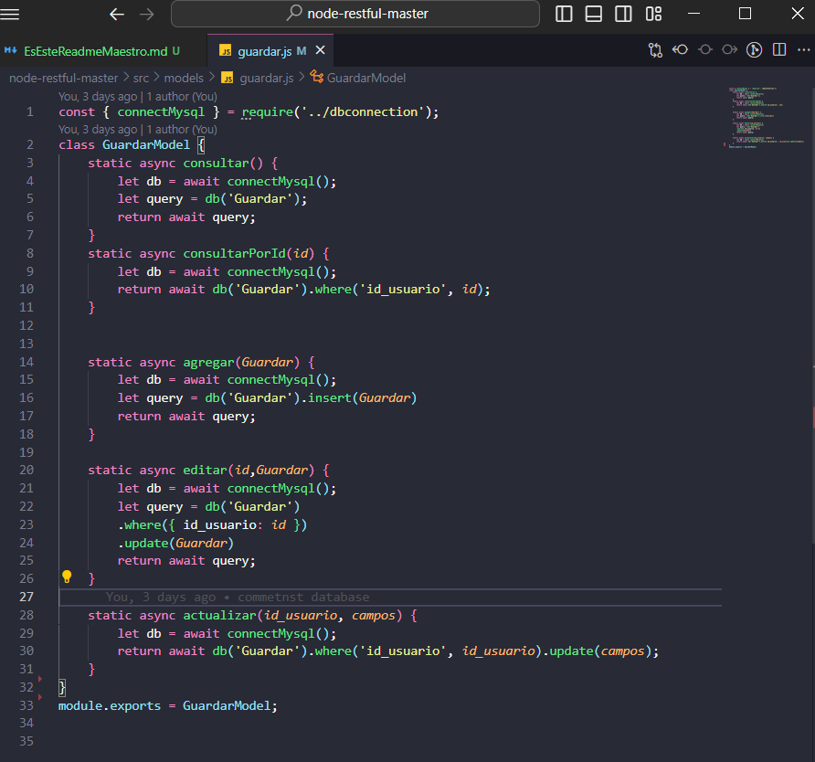

Donde mando a llamar el nombre de la tabla junto con su ID.

> Nota
>
> Tienes que tener cuidad con las mayusculas y minusculas en el nombre de tus tablas porque es sensible, lo digo porque yo tuve ese problema.


### Controllers

En controllers es donde mando a llamar al model de Guardar esta en la carpeta de Controllers con el nombre de **GuardarControllers.js** y en el tengo lo siguiente:

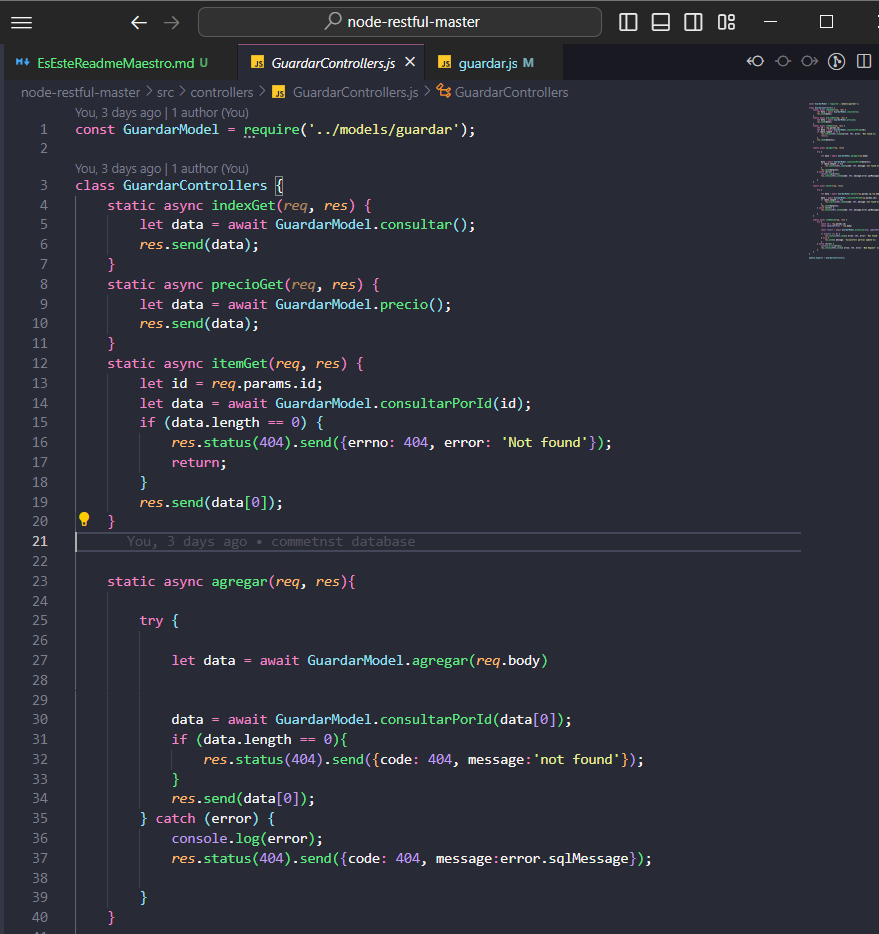
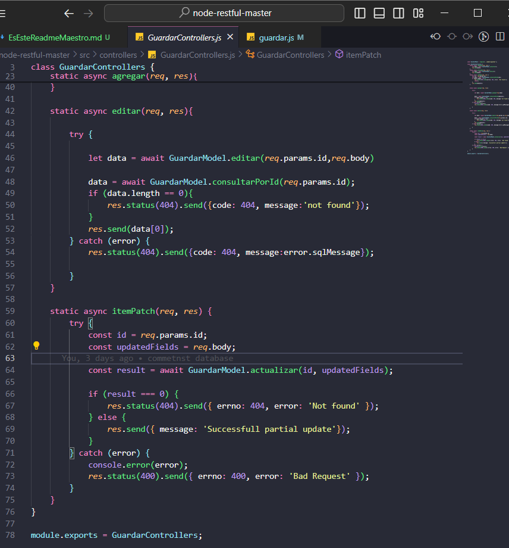

Aquí definimos los métodos que vamos a tener en este caso están los de:

- POST
- GET
- PATCH
- PUT

Pero en el caso especifico de este proyecto solo usaré el de **PUT** y **GET**.

### APP.js

En el App mando a llamar al archivo de GuardarControllers.js y a los metodos de la siguiente manera:

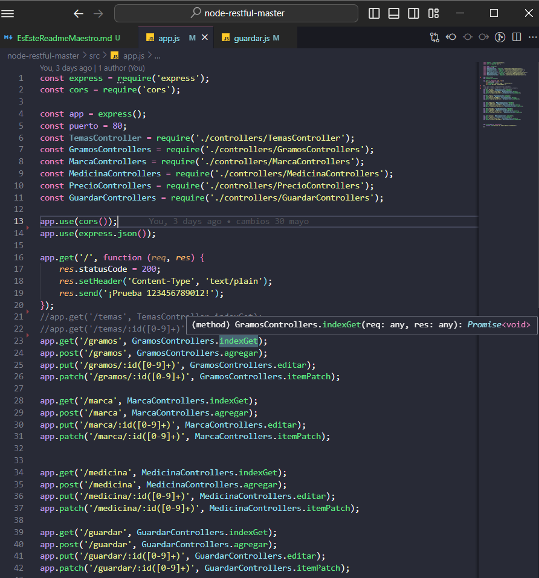

### Docker

Para saber si todo está correcto nos vamos a Docker a nuestra imagen y vemos si todo funciona correctamente

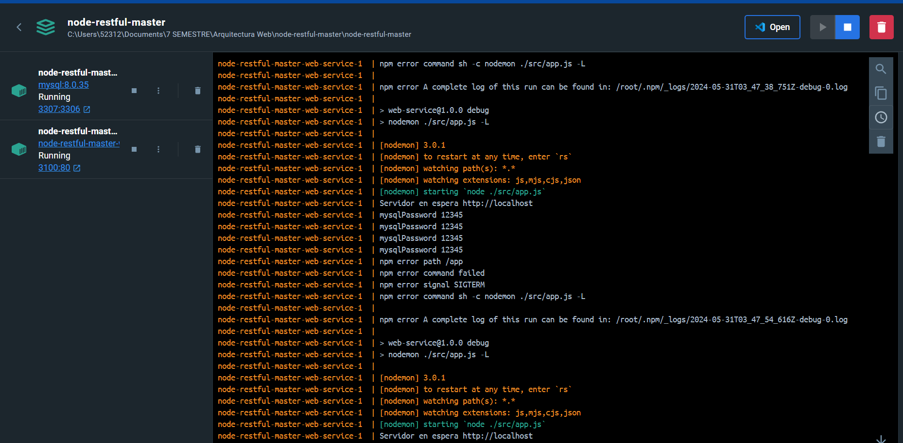

Y si todo está bien entonces podemos pasar a Postman para poder probar los métodos que queramos hacer.

>Nota
>
> En el web-service-1 despues de todos los cambios que hicimos en los archivos es mejor darle a **Restart** que es el botón que está a la derecha superior al lado del botón de eliminar.

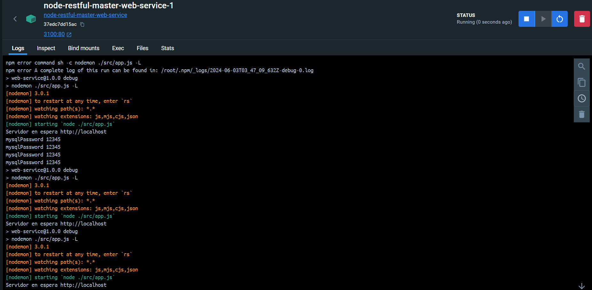

### POSTMAN

#### Método GET

El método GET manda a llamar a todos los registros que tengamos guardados en la base de datos y como se ve en la siguiente imagen al poner **http://localhost:3100/Guardar** nos manda los registros: 

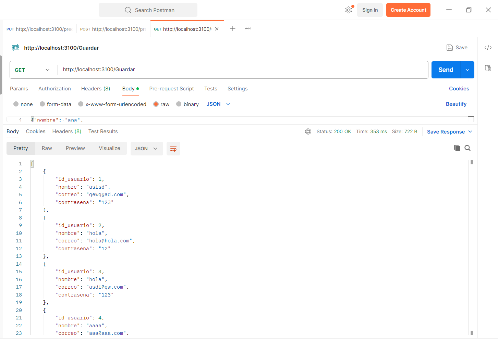

#### Método PUT

En cambio el PUT es editar, agarramos uno de los registros y editamos cualquiera de los campos que tengamos con la siguiente linea **http://localhost:3100/Guardar/5**:

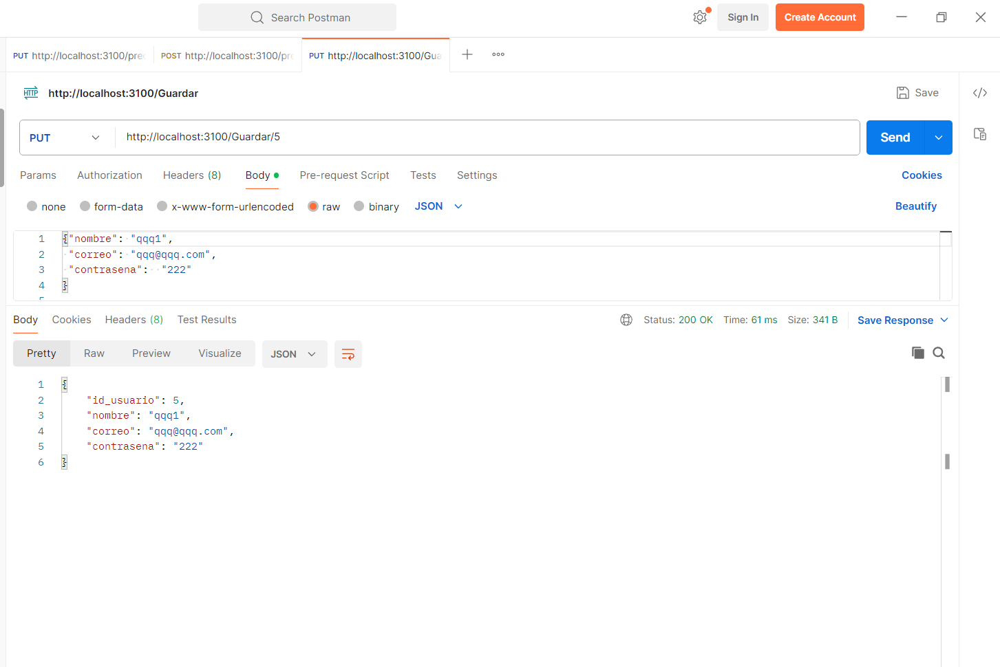

### Dbeaver

Aquí es donde se guardan nuestros registros, es nuestra base de datos y entramos de la siguiente manera:

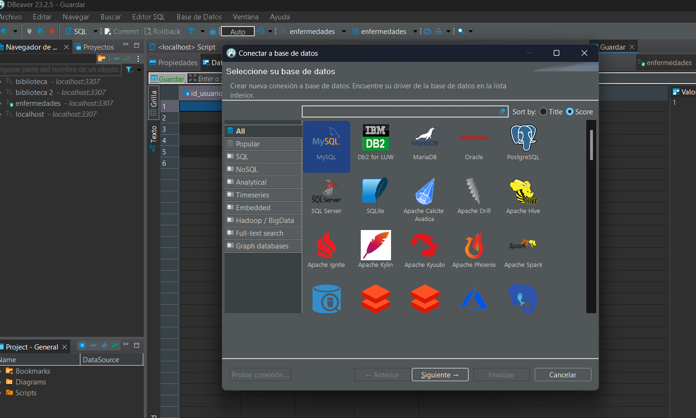
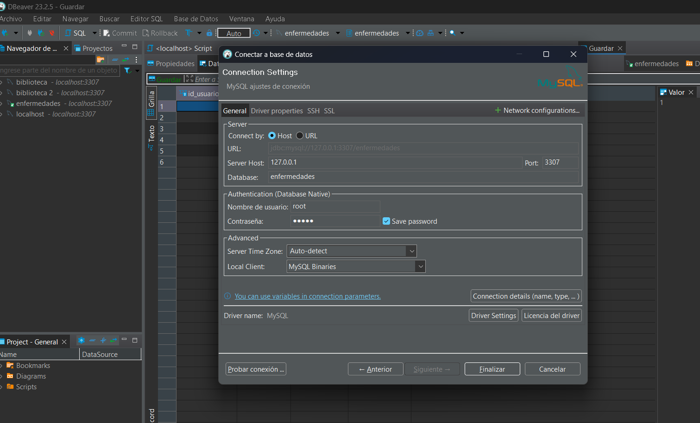

Es en MySql y desconozco si debe de ser especificamente en localhost o con la IP 127.0.0.1 porque con los dos me da correctamente el acceso a la base de datos con las tablas y los registros.

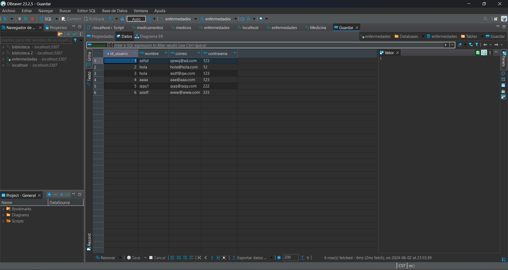


